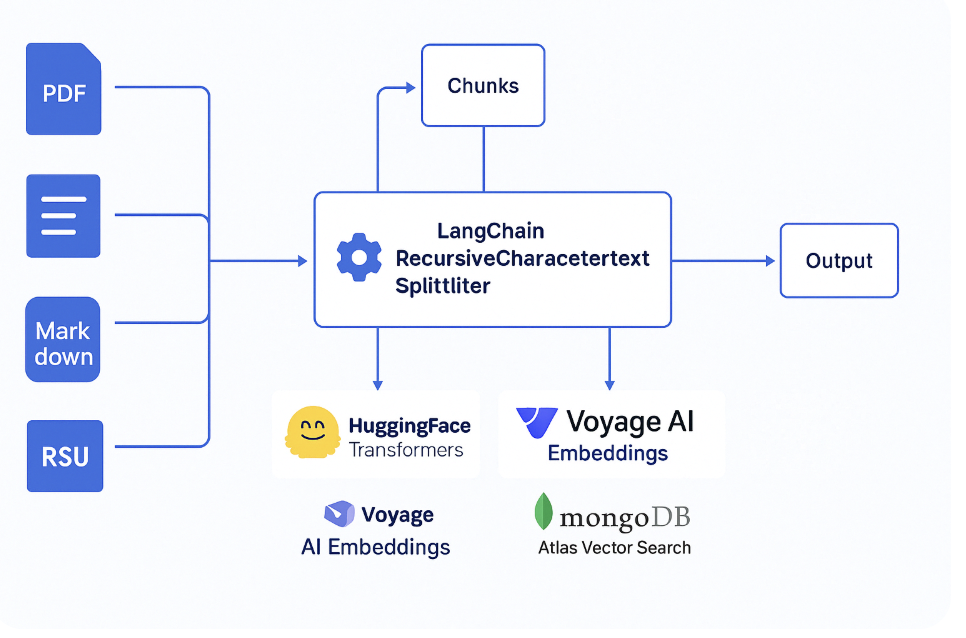

<p align="center">
  
</p>

<h1 align="center">🤗🐋 HuggingWhale.AI</h1>

<p align="center"><em>AI That Hugs Your Data</em></p>

<hr>

<p align="center">
  <a href="https://www.buymeacoffee.com/jgschmitz" target="_blank">
    
  </a>
</p>

</a> <br>
HuggingWhale.AI implements a modern Retrieval-Augmented Generation (RAG) pipeline purpose-built for unstructured document understanding and conversational querying. The system combines semantic chunking, vector embeddings, hybrid retrieval, and large language model (LLM) synthesis to deliver accurate and context-aware responses.

## 🧠 How It Works

HuggingWhale.AI is a RAG (Retrieval-Augmented Generation) system built for real-time, doc-aware LLM interactions.

Here's how the data flows through the whale 🐋:



### 📥 1. Document Ingestion
User uploads a file → `parser.py` extracts the raw text.

### ✂️ 2. Auto Chunking
Text is split into semantically meaningful chunks using a recursive chunker.

### 🧠 3. Embedding
Each chunk is embedded via VoyageAI or OpenAI and stored in MongoDB Atlas Vector Search.

### 🔍 4. Hybrid Search
When the user asks a question, we run vector + keyword search to pull back relevant chunks.

### ✨ 5. RAG Response
Top matches are sent to GPT-4 to generate a helpful, grounded answer with context.

🚀 Features <br>
Automated Chunking: Utilizes recursive chunking strategies to preserve semantic coherence while respecting token limitations.

Flexible Embeddings: Supports embeddings via Voyage AI or OpenAI.

Hybrid Retrieval: Combines vector similarity search with keyword/category filtering for enhanced relevance.

LLM Integration: Generates grounded, explainable answers using OpenAI GPT-4.

User-Friendly Interface: Interact through a CLI or web-based interface for real-time recommendations and insights.​
🔐 Hug-First Privacy
No snooping. No telemetry. No weird terms of service.
Just warm, consensual AI processing.

🔧 Installation <br>
Prerequisites
Python: Ensure you have Python 3.8 or higher installed.

Virtual Environment: It's recommended to use a virtual environment to manage dependencies.​

Setup Steps
Clone the Repository:
```
git clone https://github.com/jgschmitz/HuggingWhale.AI.git
cd HuggingWhale.AI
```
Create and Activate Virtual Environment:
```
python3 -m venv venv
source venv/bin/activate  # On Windows: venv\Scripts\activate
```
Install Dependencies:
```
pip install --upgrade pip
pip install -r requirements.txt
```
Configure Environment Variables:
Create a .env file in the root directory.

Add your API keys and other configurations:
```
OPENAI_API_KEY=your_openai_api_key
VOYAGE_API_KEY=your_voyage_api_key
MONGODB_URI=your_mongodb_connection_string
```
Run the Application:
```
python app.py
```
Replace app.py with the actual entry point of your application.

📁 Project Structure

parser.py: Handles document ingestion and preprocessing.

embedder.py: Manages embedding generation using selected models.

retriever.py: Implements hybrid retrieval logic.

responder.py: Generates responses using LLMs.

app.py: Main application entry point.​

🧪 Example Use Case
```
curl -X POST -F "file=@your_messy_notes.pdf" http://localhost:8000/parse
Output:
{
  "summary": "Your notes were unhinged. Here's what we salvaged:",
  "insights": ["Start a cult?", "Buy GPU?", "Call mom."]
}
```

🤝 Contributing:
We welcome PRs, feature requests, or just good vibes in our issues.

If you write good code, we might even react with 🐳.

📝 License
MIT. Because your startup lawyer ghosted you and we’re chill.

💬 Final Thought
AI won’t replace you.
But huggingwhale.ai might make you look like you know what you're doing.
