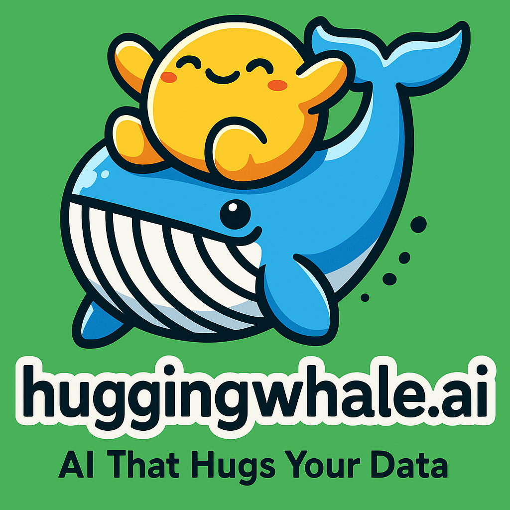

# 🤗🐳 HuggingWhale.AI

<p align="center">
  
</p>

<h1 align="center">🤗🐋 HuggingWhale.AI</h1>

<p align="center"><em>AI That Hugs Your Data</em></p>

Drop your PDF / audio / messy doc → Get structured insights like it’s nothing. Because you could build this yourself... but like, why?

🤖 What is this?
huggingwhale.ai is your all-in-one, zero-config, emoji-laden, AI wrapper playground that helps you pretend you're doing real machine learning.

We took all the hard stuff (RAG, chunking, embeddings, multi-agent orchestration)
and wrapped it in a giant whale hug. So now, you too can act like an AI savant with minimal effort. 🧠💅

This is not just another wrapper. This is another wrapper... but with vibes.

🚀 Features
🧠 Built-in RAG, Chunking, Embeddings
Plug in anything: PDFs, .mp3s, transcripts from your ex’s voicemail — we’ll extract structured insights like a clairvoyant librarian.

🧩 Multi-Agent Playground
Drag. Drop. React with 😮 when an agent misbehaves.
Yes, agents can talk to each other. Yes, they gossip.

🌈 No Config Nightmares
You won’t need YAML therapy after this.

☁️ Deploy Anywhere
Works out of the box with:

 HuggingFace 🤗

 Replicate 🌀

 Your sketchy home GPU 🖥️ in a shoebox

🔐 Hug-First Privacy
No snooping. No telemetry. No weird terms of service.
Just warm, consensual AI processing.

🔧 Installation
```
git clone https://github.com/your-org/huggingwhale.ai.git
cd huggingwhale.ai
pip install -r requirements.txt
python app.py
```
```
pip install -r requirements.txt
python app.py
```

or for the sophisticated:

```
docker run --rm -it huggingwhale/ai:latest
🎛️ Configuration (optional, like pants in a Zoom call)
```
```
rag:
  chunk_size: auto-magical
  embed_model: whale-babbler-v2
agents:
  - name: Therapist
    tone: Gentle
  - name: SassyBot
    tone: Aggressively helpful
…but seriously, it just works™.
```

🧪 Example Use Case
```
curl -X POST -F "file=@your_messy_notes.pdf" http://localhost:8000/parse
Output:
{
  "summary": "Your notes were unhinged. Here's what we salvaged:",
  "insights": ["Start a cult?", "Buy GPU?", "Call mom."]
}
```

🤝 Contributing
We welcome PRs, feature requests, or just good vibes in our issues.

If you write good code, we might even react with 🐳.

📝 License
MIT. Because your startup lawyer ghosted you and we’re chill.

💬 Final Thought
AI won’t replace you.
But huggingwhale.ai might make you look like you know what you're doing.
